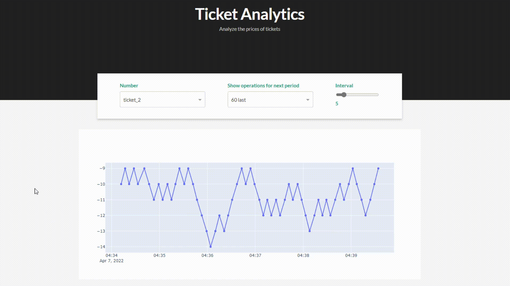

# Trade data visualization

Simple app for creating and monitoring ticket pricess in one place.

Main development now in container way, also tests only for container way.

Multiprocessing way was firstly made for checking possibilities, left for my own purposes (I just love multiprocessing)

## Stack

* Python(Dash/multiprocessing)
* Docker(+compose)
* Redis

## Assemble

`docker-compose up --build`
